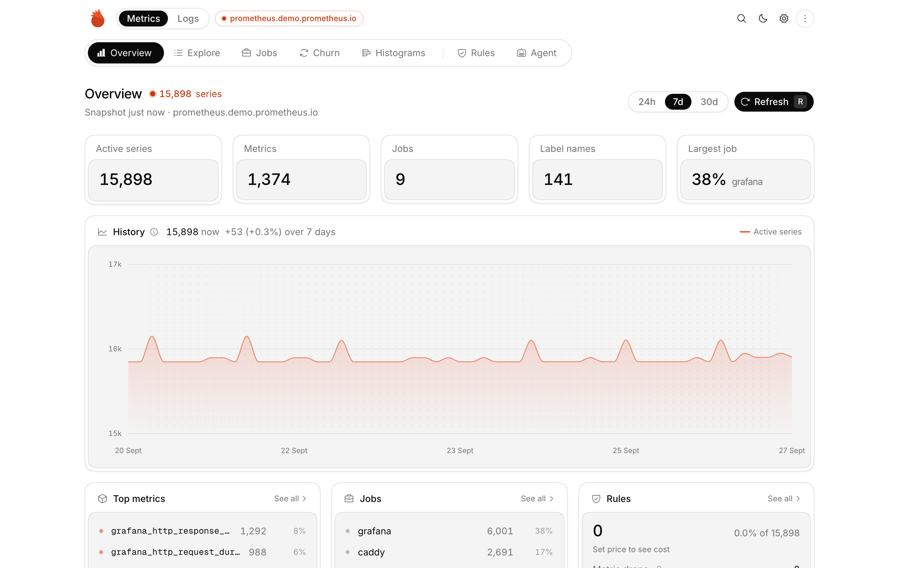

<div align="center">
  
  <h1>Cardinal</h1>
  <p><strong>Find and cut cardinality in Prometheus and Loki.</strong></p>
  <p>
    <a href="https://cardinal.ta3.dev">Open the app</a> ·
    <a href="#run-it-yourself">Run it yourself</a> ·
    <a href="#connect-an-agent">Connect an agent</a>
  </p>
</div>

<br />



Cardinal shows which jobs, metrics and labels make up your active series, and which services and labels create your log
streams and volume. Pick what to drop, check nothing depends on it, and export the rules.

## Features

- **Metrics:** series by job, metric and label, churn, and histogram bucket analysis
- **Logs:** Loki streams, labels, ingest volume and repeated line patterns
- **Safe drops:** checks alert rules and Grafana dashboards before you drop anything
- **Rules:** export Prometheus relabel configs, Grafana Alloy, Promtail and Loki limits, or apply Grafana Cloud Adaptive Metrics and Adaptive Logs
- **Grafana:** connect through your Grafana data sources, and export a dashboard that links back to Cardinal
- **Attribution:** split series, volume and cost by team, namespace or any label
- **Agents:** an MCP endpoint lets Claude or any MCP client analyse your data and propose rules for you to review

Queries run in your browser. Backends without CORS go through a stateless proxy; nothing is stored.

## Run it yourself

Cardinal is a Vite app and one Cloudflare Worker.

```bash
bun install
bun dev            # app and worker on one port
bun run test
bun run deploy     # build and deploy to Cloudflare
```

For production, set a secret that signs proxy tokens:

```bash
openssl rand -hex 32 | bunx wrangler secret put PROXY_SECRET
```

Locally, put it in `.dev.vars` together with `PUBLIC_HOSTNAMES=localhost,127.0.0.1`. Set `PUBLIC_HOSTNAMES` and
`routes` in `wrangler.jsonc` to your own domain.

## Connect an agent

Open **Agent → Start agent session**, then add the endpoint to your MCP client:

```bash
claude mcp add --transport http cardinal https://cardinal.ta3.dev/mcp \
  --header "Authorization: Bearer <token>"
```

The agent can read your snapshot, measure the impact of a change and propose rules. Nothing changes until you accept
it, and the tab has to stay open while the agent works.

## Rule formats

| Signal  | Export                                                                      | Apply                         |
| ------- | --------------------------------------------------------------------------- | ----------------------------- |
| Metrics | `metric_relabel_configs`, `write_relabel_configs`, Alloy `prometheus.relabel` | Grafana Cloud Adaptive Metrics |
| Logs    | Alloy `loki.process`, Promtail `pipeline_stages`, Loki `retention_stream`   | Grafana Cloud Adaptive Logs    |

Label drops that would merge Prometheus series are only exported as Adaptive Metrics aggregations, since relabelling them
creates duplicate samples.

<details>
<summary><strong>How it works</strong></summary>

<br />

- The React app is served as static assets from the Worker.
- `/api/proxy/*` forwards read-only API calls to backends without CORS. It refuses private hosts, only allows known
  paths, is rate limited, and needs a short-lived token from `/api/proxy-token`.
- `/mcp` and `/api/sessions` run agent sessions. Each session is a Durable Object holding a WebSocket to your tab, which
  runs every query with its own connection, so the Worker and the agent never see your credentials.

```
app/          router and app shell
features/     one folder per page
components/   shared UI (shadcn in components/ui)
hooks/        data hooks, agent bridge, impact measurement
lib/core/     pure logic: PromQL, LogQL, rules, compilers, parsers
lib/sources/  Prometheus, Loki, Grafana and Adaptive Telemetry clients
lib/agent/    MCP tools and the tab-side executor
worker/       worker entry, proxy, sessions, MCP server
```

</details>

---

<p align="center">
  Also check out <a href="https://use.observer">Observer</a>, status pages from the same metrics.
</p>
